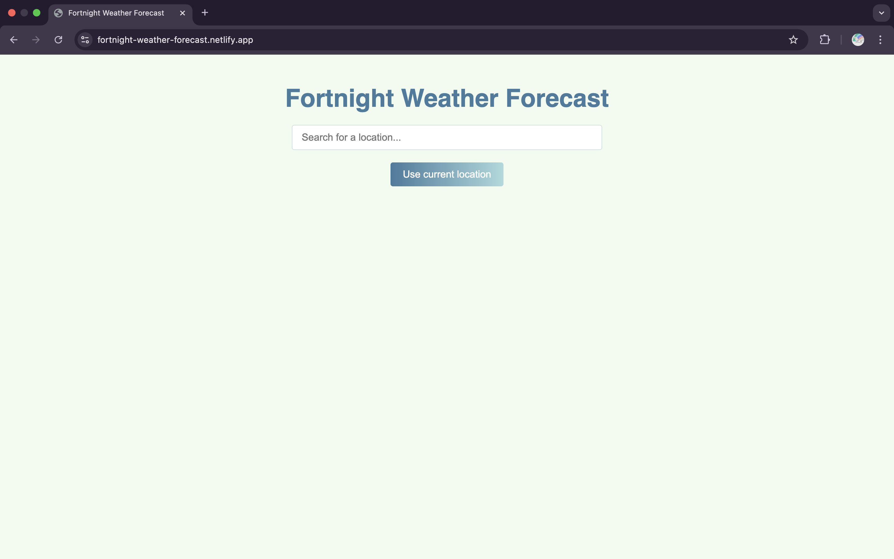
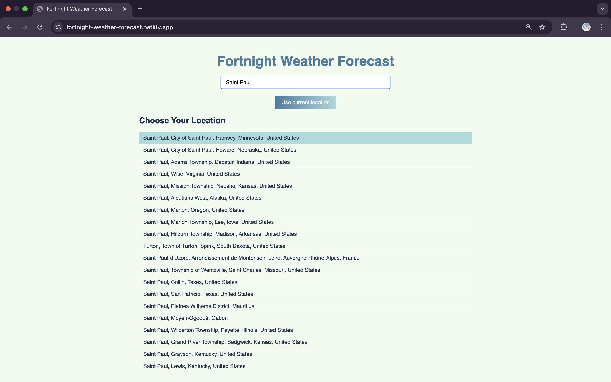
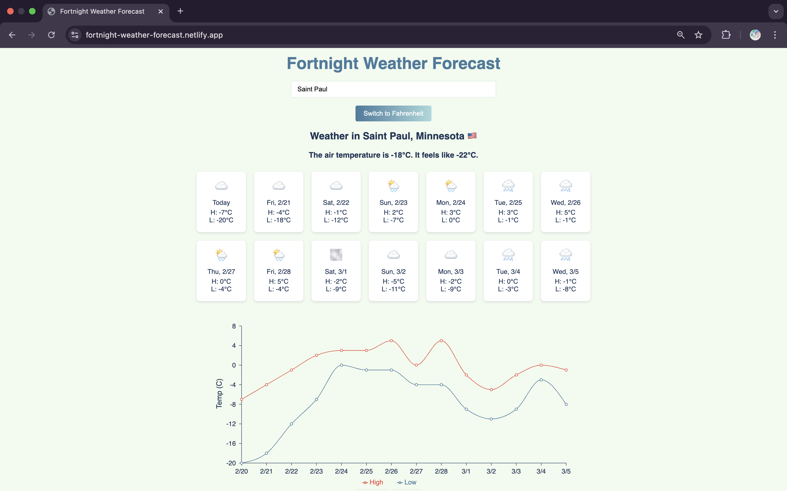

# Fortnight Weather Forecast

A responsive weather forecast app built with React that provides a 14-day forecast, current weather, and a detailed chart. Users can search for a location or use their current location, toggle between Fahrenheit and Celsius, and view the forecast in a clean, modern UI.

## Live Demo
Check out the live demo here: 

**[Fortnight Weather Forecast](https://fortnight-weather-forecast.netlify.app/)**

  

  

  

## Features

- **Location Search:** Search for a location by name with up to 10 suggestions.
- **Current Location:** Use the browser's geolocation API to fetch weather data for your current location.
- **Weather Data:** Get current air temperature, apparent temperature, and a 14-day forecast.
- **Unit Conversion:** Easily toggle between Fahrenheit and Celsius.
- **Interactive Forecast Chart:** Visualize high and low temperatures over 14 days using Recharts.
- **Responsive Design:** A mobile-friendly layout that adjusts for smaller screens.

## Technologies Used

- **Open-Meteo API:** For weather forecasts and current weather data.
- **HERE API:** For reverse geocoding to convert coordinates to a human-readable address.
- **Recharts:** For rendering interactive charts.
- **i18n-iso-countries:** For converting 3-letter country codes to 2-letter codes.

## Installation

1. Clone the repository:
   ```bash
   git clone https://github.com/andyTuruu/weather_forecast.git
   cd weather_forecast
2. Install dependendencies
   ```bash
   npm install
3. Start the development server
   ```bash
   npm run dev

##  Usage

- Search: Enter a location in the search box to see a list of results. Click on a result to load the weather forecast.
- Current Location: Click on "Use current location" to fetch weather data for your current coordinates.
- Toggle Units: Click the "Switch to Celsius/Fahrenheit" button to toggle between temperature units.
- Chart: Scroll down to view a 14-day forecast chart displaying high and low temperatures.

## Acknowledgments
- Thanks to Open-Meteo for providing the weather data.
- Thanks to HERE for their geocoding services.
